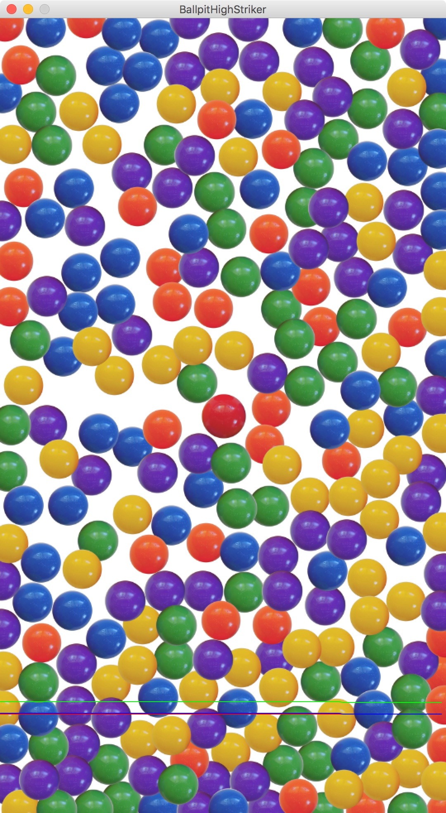
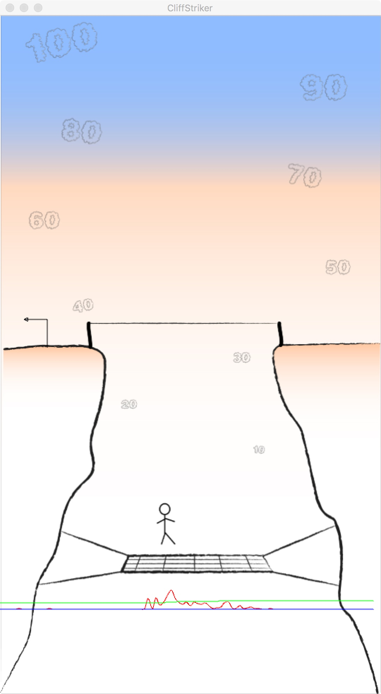
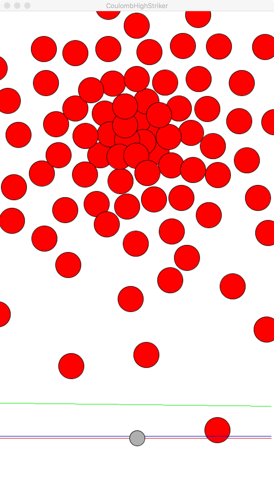
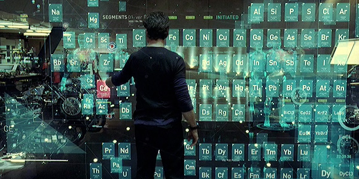
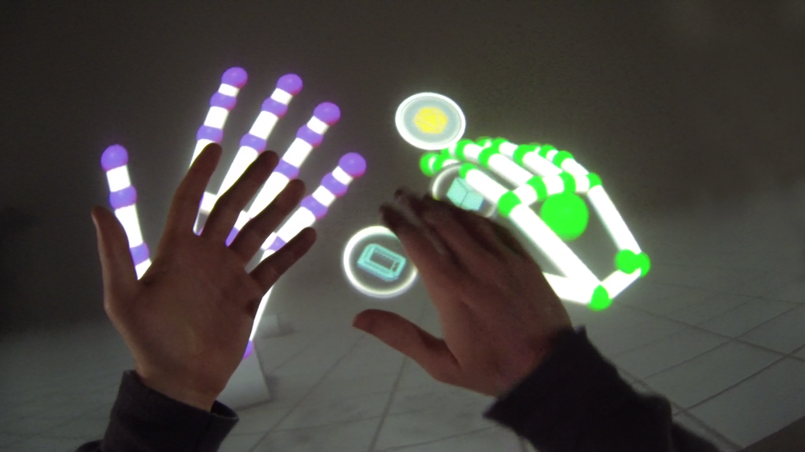

# independent:

_An independent study with professor Zevensuy Rodriguez_. Some of the projects
here:

- [x] Processing High Striker
- [ ] Processing Leap Motion (_Coming Soon_)

## Processing High Striker

You know the game where you hit a lever with a hammer and the puck shoots up
and (depending on how strong you are) hits a bell? This is the digital
version, based on audio, and it takes so many different forms:

- Classic: simple puck and bell game.
- Ballpit: loud sounds trigger a wave of motion in a ballpit.
- Balloon: loud sounds fire up a fan which pushes a balloon towards a tac.
- Coulomb: balls are attracted to a point and deflect each other with charge.
- Cliff: a guy is tightroping between two cliffs. Knock him off the rope with loud sounds and watch him bounce up high

Check out each of the sub-directories for an in depth explanation of the cool
things that built each project.

Samples:

## Processing Leap Motion

In every Iron Man movie, Tony Stark has some cool home computer system that
reacts to his every work and movement.

While that may look a bit futuristic
and farfetched, the reality is that it's pretty close to existance.

Leap Motion is a small sensor that recognizes where your hands are and allows
you to use that input to make some pretty cool stuff.

