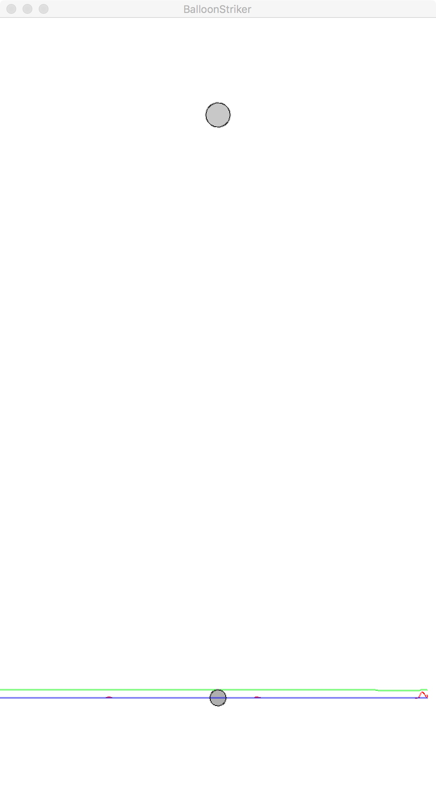
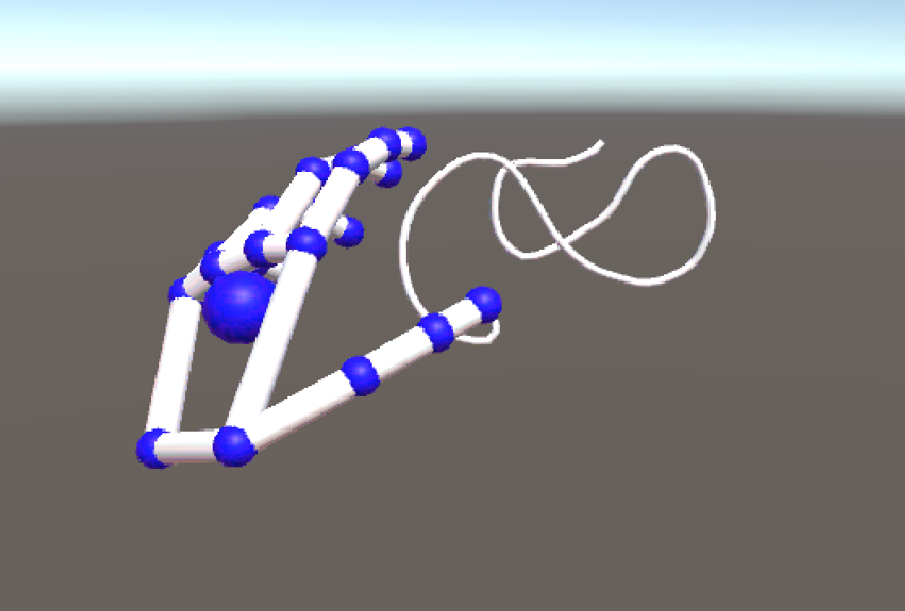

# independent:

_An independent study with professor Zevensuy Rodriguez_. Some of the projects
here:

- [x] Processing High Striker
- [x] Unity & the Leap Motion

## Processing High Striker

You know the game where you hit a lever with a hammer and the puck shoots up
and (depending on how strong you are) hits a bell? This is the digital
version, based on audio, and it takes so many different forms:

- Classic: simple puck and bell game.
- Ballpit: loud sounds trigger a wave of motion in a ballpit.
- Balloon: loud sounds fire up a fan which pushes a balloon towards a tac.
- Coulomb: balls are attracted to a point and deflect each other with charge.
- Cliff: a guy is tightroping between two cliffs. Knock him off the rope with loud sounds and watch him bounce up high

Check out each of the sub-directories for an in depth explanation of the cool
things that built each project.

Samples:

   

## Leap Motion

In every Iron Man movie, Tony Stark has some cool home computer system that
reacts to his every work and movement.

While that may look a bit futuristic
and farfetched, the reality is that it's pretty close to existance.

The Leap Motion is a device that tracks the positions of your hands, allowing you to do some pretty cool stuff.
You can pick up and move around objects, interact with a virtual world, and even draw in 3D.
That last one interested me, so I set about setting it up with one draw-back: I don't have a VR headset.
It seemed to me that most of the world doesn't own a VR headset, so why only make a drawing app for those who do?
In a very straight-forward way, that's exactly what this project does. It allows you to draw with your hands in a 3D world.
Check out `doc.md` to see how I did it.

